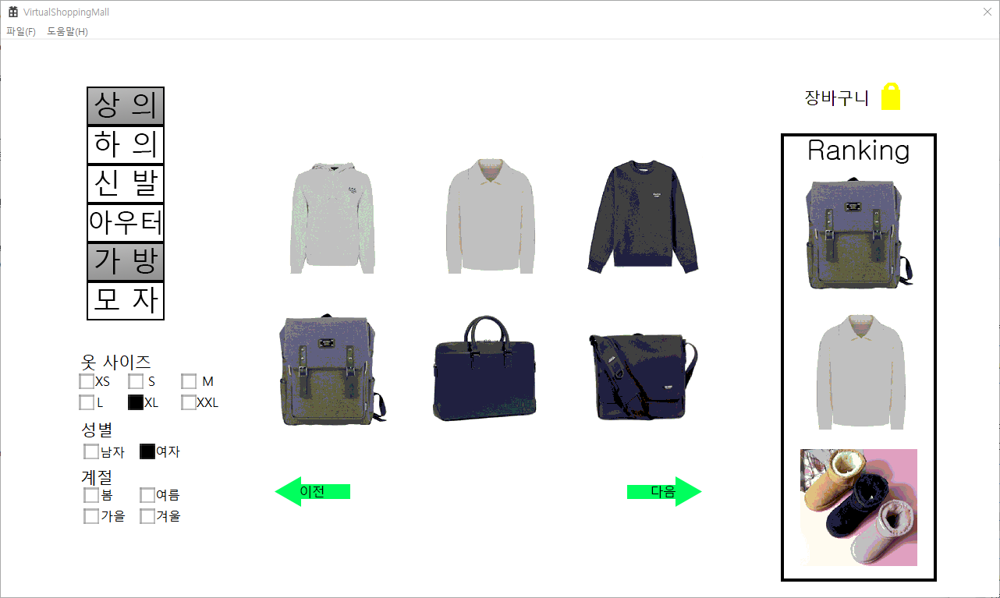

# 🛍️ Virtual Shopping Mall (C++ Windows API)

C++의 Windows API를 활용하여 제작한 가상 쇼핑몰 애플리케이션입니다.  
해당 프로젝트는 1학년 멘토-멘티 프로그램의 일환으로 **팀 프로젝트**로 진행되었습니다.

## 📌 주요 기능
- 의류 카테고리별 상품 출력 (상의 / 하의 / 신발 / 아우터 등)
- 필터링 기능 (성별 / 계절 / 옷 사이즈)
- 장바구니 담기 및 확인
- 인기 순위 상품 출력
- 이미지 기반 UI 구성 및 간단한 페이지네이션

## 🧑‍🤝‍🧑 팀 구성 및 역할
- 팀 프로젝트 (멘토-멘티 8인 구성)
- 멘토로써 **카테고리 필터링**, **장바구니 기능**, **전체 기능 통합**을 포함한 **기획 및 기능 설계 지원**을 맡음
- 구조 개선 및 구현 우선순위 정리

## 🛠️ 개발 환경
- C++
- Windows API (Win32)
- Visual Studio

## 📸 실행 화면

### 🧭 메인 화면

### 📂 카테고리/필터 기능

### 🛒 장바구니 보기

### 👕 상품 상세 페이지

## 📂 파일 구성
- 총 34개 이상의 `.cpp` 및 `.h` 파일로 기능별 세분화되어 구현됨
- 내부 구조: 카테고리, 필터링, 장바구니, 인기순위, 유저 인터랙션 등 모듈화

---

💡 멘토-멘티 프로젝트로 주어진 기간 내 실동작 가능한 GUI를 직접 구현한 경험이 강조된 프로젝트입니다.
